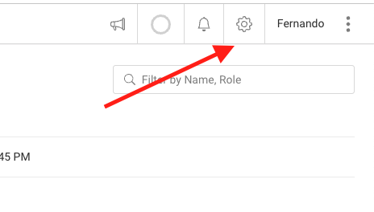
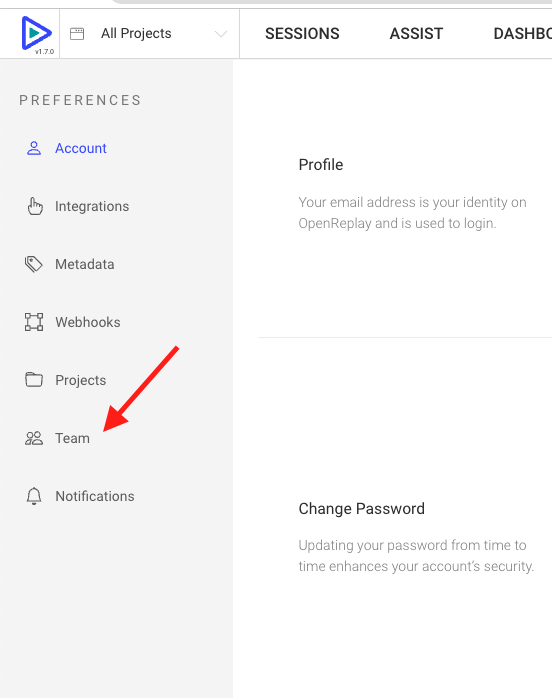
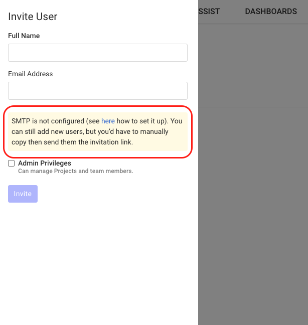

Once you've installed your self-hosted version of OpenReplay, you'll be able to sign-up **only one user** on that system.
Afterwards, the `openreplay.<yourcustom-domain>/signup` link will not work, in fact, it will redirect to the log-in page.

If you need more users to access the system, you'll have to invite them into your team.

## Inviting users to your team
Notice that the "team" is already created when you sign-up, so there is no need to worry about that part. Instead, you'll only want to invite your colleagues using the following steps:

1. Go to the settings section by clicking on the cog icon located on the top-right corner of your screen:

2. Once there, click on the "Teams" option from the menu located on the left side of the screen:

3. You should now be looking at your team, which consists of only you (if you haven't invited anyone yet). Now click on the "+" icon next to "Team 1".

4. Now start filling in the information requested, which is the full name of the user and their email address. You'll also be able to give them Admin proviledges if you want to, which would allow them to access project configurations and to invite other users into the team.

**Note the SMTP warning**
If you haven't yet configure the SMTP server for OpenReplay, your users will not get a notification email with the sign-up link. So if you still need to configure it, check out how to do it with [this link](https://docs.openreplay.com/configuration/configure-smtp).

---

If you have any issues adding new users to your self-hosted installation, please contact us on our [Slack community](https://slack.openreplay.com/) and ask our devs directly!