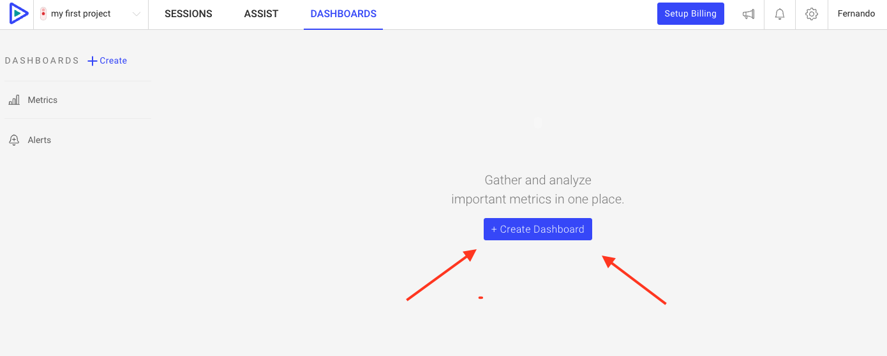
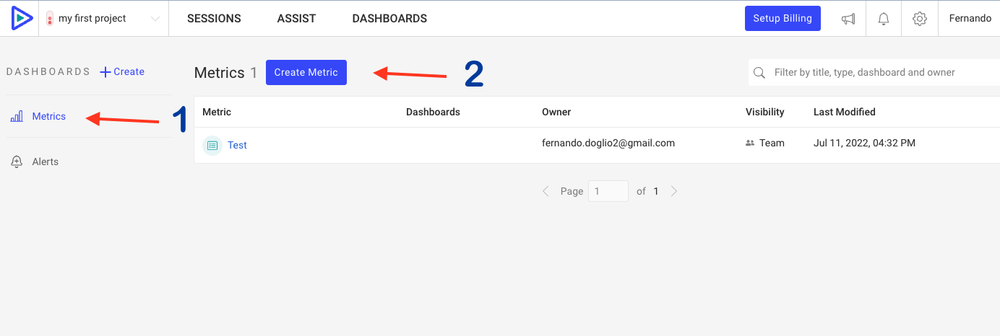
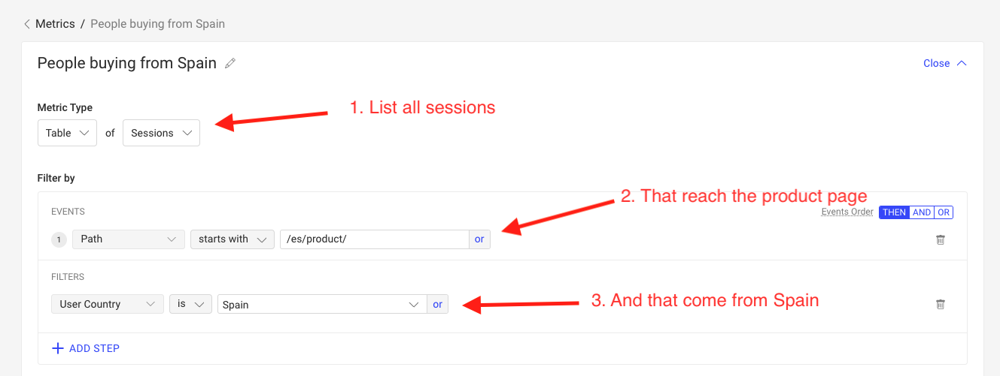
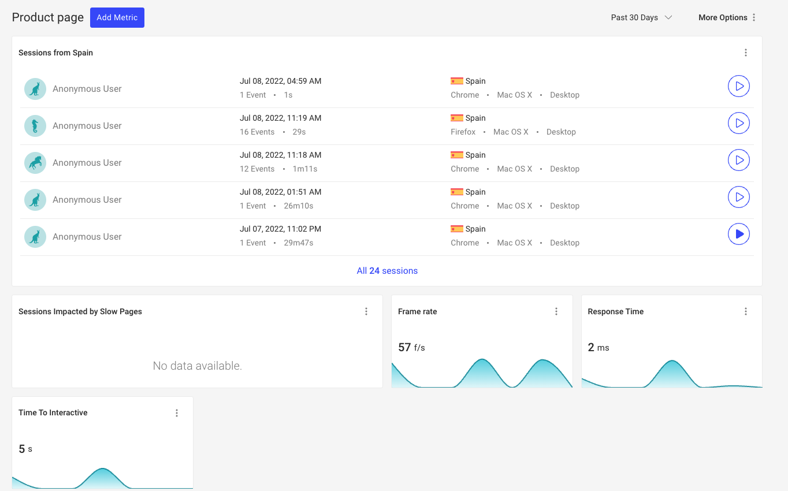

What's the point of measuring your application's performance if you don't have a centralized place to look at those metrics?

There is no point, that's the answer.

And at the same time, that's why OpenReplay has recently added the ability for their users to create custom dashboards.

Through these dashboards, users can create a single visualization where they can get a glimpse at the status of their entire application.

Additionally, you can create dashboards just for you or your entire team. Thus, eliminating the need to duplicate the dashboards if more than one person needs it.

Let's take a look at how users can do that.

## Creating a custom dashboard

**Note:** If you want a quick tutorial showing you how to implement a dashboard with custom metrics, you can checkout [this YouTube video](https://www.youtube.com/watch?v=hxnONp79Mwc).

Click on the Dashboards section on the main menu to get started.

Then click on the "Create Dashboard" button that's staring at you right from the middle of the screen:

Once you click on it, you'll be presented with every single metric that OpenReplay is capturing about your application. 

You can think abou these metrics in the following categories:

- **Error related**: these metrics will show you problems with your application.
- **Performance related**: with these metrics you’ll be able to evaluate how well is your application running for your users.
- **Resources related**: problems with images not loading, or slow-downs becuase of JavaScript files that are too big are the type of problems you’ll pinpoint with these metrics.
- **Web Vitals**: These are the metrics used by search engines like Google to determine the quality of a web page/application.
- **Session related**: These are metrics about the actual replays, they give you an idea of how much traffic your application is having and what percentage of it are you capturing.

Let’s take a look at how our metrics can be organized within these groups and what each one means:

### Error related metrics

- **Errors by Origin**: number of errors per day split into 3rd party vs. 1st party (yours) errors.
- **Errors by Type**: number of errors classified by status code, JavaScript or integration with other services.
- **Errors Per Domain**: number of errors (grouped by domain) during the selected period.
- **Fetch Calls with Errors**: The fetch calls/responses that are having 5xx-4xx.
- **Sessions Affected by JS Errors**: number of sessions per day affected by JS errors.
- **Top Domains with 4XX Fetch Errors**: main domains with Bad Requests types of errors
- **Top Domains with 5XX Fetch Errors**: main domains where the errors are from the server side.
- **Crashes**: number of crashes per day of your application.

### Performance related metrics

- **CPU Load**: the average CPU load per day.
- **DOM Build Time**: the average time it takes the entire DOM of your application to build, distributed over time.
- **Slowest Domains**: The domains from which the slowest resource (js, css, images) were downloaded.
- **Request Load Time:** The response time of an http (fetch/xhr/axios) request.
- **Response Time**: the average response time to the requests sent by your application.
- **Memory Consumption**: the average memory consumption across all recordings of your project.
- **Sessions impacted by Slow Pages**: number of sessions where slow pages are detected every day.
- **Frame Rate**: the average responsiveness of your UI.
- **Page Load Time**: the average time passing from the moment your browser sends the request to the backend and the moment where the page is done loading.
- **Pages Response Time**: the average time it takes your server to send back the response from the browser.
- **Pages Response Time Distribution**: The distribution of the page response times (loads) so you can spot

### Resources related metrics

- **Breakdown of Loaded Resources**: number of resources loaded by day separated by CSS, images, and scripts.
- **Missing Resources**: Images (primarily) or fonts or icons or stylesheets or js that couldn’t be loaded and therefore missing. That means that those pages redenring them will be impacted.
- **Resources Fetch Time**: the average time it takes for different resources to load
- **Slowest Resources**: the list of the top slowest resources with their associated load time.
- **Image Load Time**: the average time it takes your images to load.
- **Resources Loaded vs. Visually Complete**: number of resources loaded vs. the amount of time it takes for them to be visually loaded (like images, but also taking scripts and CSS into account).
- **Resources loaded vs. Response End**: number of resources loaded via XHR (and other types of requests) vs. the time taken by the backend to deliver them.

### Web Vital metrics

- **Time to Interactive**: the average amount of time it takes your UI to become completely interactive (responsive to user input).
- **Speed Index by Location**: the average time (per country) it takes the *visible* content of your page to populate it.
- **First Paint**: the average time it takes the browser to render the first pixel of your UI.
- **DOM Content Loaded**: the average time it takes for the initial HTML document to completely load and get parsed by the browser (without taking into account stylesheets, images and subframes).
- **Time to Render**: The time it takes the browser to render the loaded DOM. Would be nice to show the difference with DOM Content Loaded.
- **Time Till First Byte**: the average time it takes for your user's browser to receive the first byte after requesting a page.

### Session related metrics

- **Captured Requests**: the number of requests done on each recorded session.
- **Captured Sessions**: the number of sessions captured for a project over time.
- **No. of Visited Pages**: the average amount of visited pages during a session.
- **Sessions Per Browser**: How many sessions captured for a particular browser (i.e. Chrome).
- **Session Duration**: the average session duration per day for your project.

You have 40 metrics to choose from, that means you can create the type of dashboard you need, regardless of what you're looking for.

Once presented with the list of metrics, all you have to do is click the ones you want, and once you have them all, click on the "Create" button located in the lower left corner of the screen.

### Creating custom metrics
Other than the pre-defined metrics presented by the platform, you can create your own to fully customize the level of details you have inside your dashboards.
Under the same Dashboards section, instead of creating a new dashboard, click on the Metrics option on the left side of the screen and choose "Create Metric".

Give it a name, in my case I'll call it "Sessions from Spain" (you'll see why in a minute).
Then choose the metric type, you have:

- **Timeseries**: this will plot the number of sessions that match the filtering criteria from below.
- **Table of [option]**: this will list whatever you select for "option" (it can be either Users, Sessions, JS Errors, Issues, Browsers, Devices, Countries and URLs ). Each element on this list will be clickable and you'll be able to get more details from it.
- **Funnels**: it will create a funnel based on the filters you select (check out [this tutorial](/tutorials/funnels) to understand how to take advantage of funnels).

If you'd like to know how to work with the JSErrors list, check out [this other tutorial](/tutorials/js-errors-dashboard).

For this example, I'm going to create a metric that lists all sessions from the product's page that come from Spain. This will let me quickly see how many sessions I get inside my chosen time window and at the same time, I'll be able to reproduce them with a simple click.

You can duplicate this metric, and filter them by other countries, that way you can get a glimpse of who's accessing a specific section of your site from different countries and how are they interacting with it.

## Creating a custom dashboard

For example, let's assume you're trying to create a simple dashboard that shows the slowness indicators to understand where the slow-related problems are coming from.
And on top of that, you'll want to add the list of prople from Spain that have reached the product page of your e-commerce site. 

So you'll go with:

- Slowest resources
- Sessions impacted by Slow Pages
- Framerate
- Response time
- Time to Interactive
- Your custom "Sessions from spain" metric

Depending on your use case, you could think about adding others, but for this example, these metrics will provide us with the full picture of what we're trying to understand: if our pages are slow and what is causing it.
The result should look something like this:

The widgets you added can be moved around to make sure you see first the ones you're most interested in.

You can also change the time window used to chart these metrics. By default, as you can see on the top-right corner of the dashboard, these widgets are showing you the last 7 days' worth of data.
You can change the time range to:

- Today, showing you only the data collected so far today.
- Yesterday, showing you a summary of the previous day.
- Past seven days, which is the default option selected.
- Past 30 days, showing you a bigger time range.
- Custom range, which lets you select the time range you want.

You can also keep adding metrics to the new dashboard using the "Add Metric" button on the top-left corner next to the title.

---

You can create as many dashboards as you like; they can act as different views of your system and show you an integrated summary of what is happening. You can then use them to filter the replays and understand what is happening in your application.
