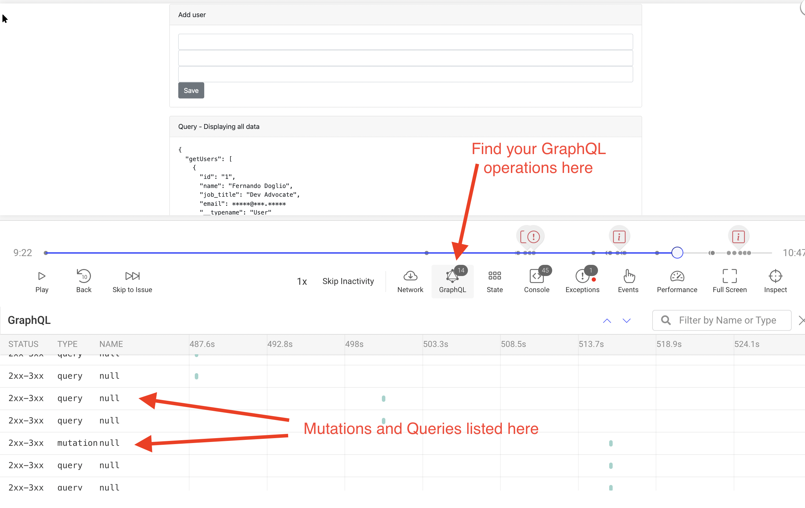
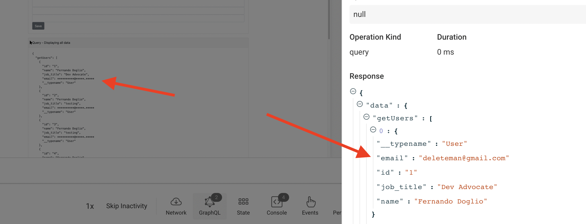
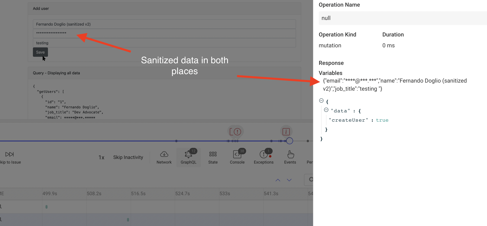

If you’re using GraphQL as a query language for your APIs from within your application, then the [GraphQL plugin](https://docs.openreplay.com/plugins/graphql) can help you track both, mutations and queries performed against your GraphQL server.

In this tutorial, we’ll use the Apollo Boost client, but as long as the client you’re using allows you to set up some middleware, you’ll be able to use the plugin in your code.

If you’d like to follow along, you can [check out this repo](https://github.com/deleteman/openreplay-graphql-example) which contains both, the GraphQL server and the client app. 

## Setting up the Tracker first

Before installing the GraphQL plugin, you’ll need to have the Tracker installed. If you already know how to do this, skip to the next section, otherwise keep reading.

We’ll save this code inside a separate module that will export two functions: `init` and `start`.

The first function will instantiate the tracker and set up all plugins; the second will only call the `start` method. 

```jsx
import OpenReplay from '@openreplay/tracker';

let _tracker = null;

export function init({plugins}) {

    _tracker = new OpenReplay({
        projectKey: process.env.OPENREPLAY_PROJECT_KEY
    });

    
    let pluginResults = {}
    if(plugins) {
        Object.keys(plugins).forEach( pk => {
            pluginResults[pk] = _tracker.use(plugins[pk]())
        })
    }
    return pluginResults
}

export function start() {
    return _tracker.start()
}
```

The interesting bit about the init function, is that it returns an object composed of all the plugin’s returned values. Some of our plugins will return a function you’ll have to use later on (like in the case of the GraphQL plugin). This approach allows you to initialize the tracker with all the plugins at once, and then use the returned values whenever you want.

## Using the plugin

After installing the plugin with npm i @openreplay/tracker-graphql use the following code to call the init function we just defined:

```jsx
import trackerGraphQL from '@openreplay/tracker-graphql';
import {init} from './tracker/index'

const {graphqlTracker} = init({
  plugins: { 
    graphqlTracker: trackerGraphQL
  }
})
```

The `graphqlTracker` key used here can be anything you want. As long as the key used inside the `plugins` section is the same as the one you’re destructuring from the `init` function results, you’ll be fine.

## Setting up the plugin with Apollo client

For this tutorial, we will use the Apollo Boost library, which allows you to modify each request's data flow through what they call “links”.

These links are like middleware functions you can use to intercept the data flow of a request and, in our case, record it.

The following code will create a new link using the `ApolloLink` function. This link will capture the operation’s data and results, and call our `graphqlTracker` function (the one returned from the `init` call above).

```jsx
const trackerApolloLink = new ApolloLink((operation, forward) => {

  const operationDefinition = operation.query.definitions[0];
  let {operationName, variables} = operation
  const {kind, operation: op} = operationDefinition
  const opKind = kind === 'OperationDefinition' ? op : 'unknown?'

  let results = forward(operation).map((result) => {
    return graphqlTracker(opKind, operationName, variables, result);
  });
  if(results.length === 0) { //if there are no results, then we've not tracked anything so far...
    graphqlTracker(opKind, operationName, variables, {});
  }
  return results
});
```

With that out of the way, we can use the newly created link as follows:

```jsx
import {ApolloClient,  HttpLink } from 'apollo-boost';
import { ApolloProvider } from '@apollo/react-hooks';
import { InMemoryCache } from 'apollo-cache-inmemory';
import { ApolloLink, from } from '@apollo/client';

const link = from([
  trackerApolloLink,
  new HttpLink({uri: () => 'http://localhost:4000/graphql'}),
]);

const client = new ApolloClient({
  link,
  cache: new InMemoryCache()
});

ReactDOM.render(<ApolloProvider client={client}>
  <App />
</ApolloProvider>, document.getElementById('root'));
```

The above code is taken from the Apollo documentation, at this point the tracker and the plugin have already been set, so you don’t really have to worry about anything else.

Once done, your replays will show a new section listing all GraphQL operations.



That said, the sensitive information that is automatically sanitized by the tracker (like email addresses) will not be sanitized by the plugin. So you’ll have situations like the following where the DOM has the sanitized data, but the operation details show the actual data.



While the plugin itself doesn’t provide any sanitization function, we can still add code that will hide personal and private information from the replay to help keep your user’s privacy.

## Sanitizing the recorded data

If you look at the code sample where I create the trackerApolloLink object, you’ll see that all I’m doing is calling the tracker function that saves information on the tracker.

If I don’t change the data, then everything gets saved unchanged. So to sanitize the data in the replay **and keep the operation unchanged**, we need to clone the key variables before calling the tracker. That means cloning the variables and the results from the operation, and that’s all we want. 

So here is a snippet of code that will create the ApolloLink and keep the data secret within the replay data:

```jsx
/**
 * Sanitize the result from a GraphQL operation
 * @returns Returns the result object but with the sanitized fields changed.
 */
function sanitizeResult(res) {
  //deep clonning needs to happen to make sure this only affects the new object and not
  //the original object.
  let sanitized = JSON.parse(JSON.stringify(res))

  let ops = Object.keys(sanitized.data)
  ops.forEach( o => {
    if(Array.isArray(sanitized.data[o])) { //mutations don't really return arrays
      sanitized.data[o] = sanitized.data[o].map( sanitizeData )
    }
  })
  return sanitized
}

// We only want to hide the content of othe "email" field for now.
function sanitizeData(vars) {
  let newVars = {...vars}
  if(newVars.email) {
    newVars.email = "****@***.***"
  }
  return newVars
}

const trackerApolloLink = new ApolloLink((operation, forward) => {

  const operationDefinition = operation.query.definitions[0];
  let {operationName, variables} = operation
  const {kind, operation: op} = operationDefinition
  const opKind = kind === 'OperationDefinition' ? op : 'unknown?'

  let trackedVariables = sanitizeData({...variables})
  let results = forward(operation).map((result) => {
    let trackedResults = sanitizeResult(result)
    graphqlTracker(opKind, operationName, trackedVariables, trackedResults);
    return result //we have to return the original "result" object here, not the sanitized one
  });
  if(results.length === 0) { //if there are no results, then we've not tracked anything so far...
    graphqlTracker(opKind, operationName, trackedVariables, {});
  }
  return results
});
```

Key aspects of this code are:

1. We’ve added two functions, one to sanitize the `email` from an object and one to sanitize the results of a GraphQL operation.
2. Inside the `map` callback (from the link function), we’re now not returning the output from graphqlTracker, because that function will return the result value it received untouched. 1. But that result will be returned to the client app, and if we’re sanitizing the result, the user will see the sanitized version of the dataset. Instead, we need to clone the result to modify the one being tracked and return the original.
3. The `sanitizeResult` function deep clones the object because modifying otherwise will change the result itself.



---

You can [check out this repository](https://github.com/deleteman/openreplay-graphql-example) for the **complete source code** of a working GraphQL-based application with the Tracker.

If you have any issues setting up the Tracker on your GraphQL project, please contact us on our [Slack community](https://slack.openreplay.com/) and ask our devs directly!