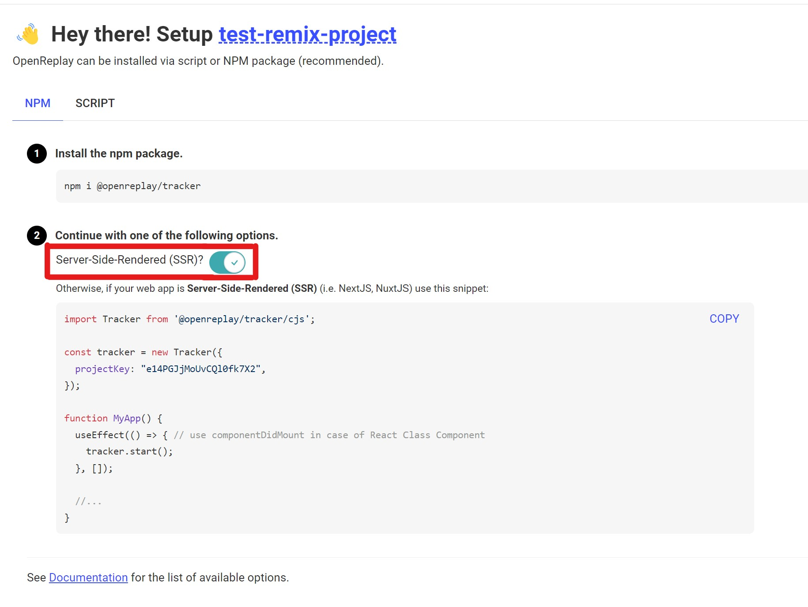

Installing the OpenReplay tracker into a Remix-based project is relatively straightforward.

With your Remix project ready,  look for the `root.jsx` file inside the `app` folder, and include the SSR code provided by OpenReplay when you created the project on the platform.

## Step 1. Get the code

You can definitely use the code presented by the platform, that would represent the bare minimum you need to get started. If you do, make sure you select the “Server-Side-Rendered (SSR)” option like shown below.



But for this example, we’re going to create a sample module which we’ll save as `tracker.ts` inside the `app` folder. This module will export a function called `startTracker` which will instantiate the tracker, and get it going.

```jsx
import {v4 as uuidV4} from 'uuid'
import Tracker from '@openreplay/tracker'

function defaultGetUserId() {
    return uuidV4() 
}

type TrackerConfig = {
    projectKey: string,
    userIdEnabled?: boolean,
    getUserId?: () => string
}

export function startTracker(config: TrackerConfig) {
    let tracker = null;
    let userId = "";
   
    console.log("Starting tracker...")
    console.log("Custom configuration received: ", config)
        
    const getUserId = (config?.userIdEnabled && config?.getUserId) ? config.getUserId : defaultGetUserId
        
    const trackerConfig: TrackerConfig = {
        projectKey: config?.projectKey
    }
        
    console.log("Tracker configuration")
    console.log(trackerConfig)
    tracker = new Tracker(trackerConfig);
        
    if(config?.userIdEnabled) {
        userId = getUserId()
        tracker.setUserID(userId)
    }
     
    tracker.start();
      
    return {
        tracker,
        userId
    }
}
```

If you run into issues importing the Tracker module from OpenReplay this way, consider using a dynamic import, like so:

```jsx
import {v4 as uuidV4} from 'uuid'

function defaultGetUserId() {
    return uuidV4() 
}

type TrackerConfig = {
    projectKey: string,
    userIdEnabled?: boolean,
    getUserId?: () => string
}

export function startTracker(config: TrackerConfig) {
    let tracker = null;
    let Tracker = null
    let userId = "";
    
    (async () => {
				//dynamic import 
        Tracker  = (await import('@openreplay/tracker')).default 
        console.log("Starting tracker...")
        console.log("Custom configuration received: ", config)
        
        const getUserId = (config?.userIdEnabled && config?.getUserId) ? config.getUserId : defaultGetUserId
        
        const trackerConfig: TrackerConfig = {
            projectKey: config?.projectKey
        }
        
        console.log("Tracker configuration")
        console.log(trackerConfig)
        tracker = new Tracker(trackerConfig);
        
        if(config?.userIdEnabled) {
            userId = getUserId()
            tracker.setUserID(userId)
        }
        
        
        tracker.start();
        
    })()
    
    return {
        tracker,
        userId
    }
}
```

💡**A note for self-hosted users:** if you’re using the self-hosted version of OpenReplay, you’ll also have to specify the `ingestPoint`configuration property. This property specifies the ingestion endpoint for the tracker’s data. Cloud users don’t need this, because by default 
the tracker will know where the SaaS version of this endpoint is, but if 
you’re self-hosting it, you’ll need to specify it (it should be something like `https://openreplay.mydomain.com/ingest`)

## Step 2.  Add the code and the tracker to your project

With that out of the way, you’ll need to install the tracker package for your project using:

```markdown
$ npm install @openreplay/tracker
```

You’ll also need to install the [uuid package](https://www.npmjs.com/package/uuid) to make sure the above code works as it is.

Once that is done we’re almost ready to start tracking, but we still need  to configure the **project key** as an ENV variable and somehow pass it to the tracker vía the `config` object received in the `startTracker` function.

### Loading ENV variables in Remix

ENV variables are accessible in the back-end, so we’ll take advantage of the `loader` function that can be used to load any external data, including ENV variables. 

And then we’ll use the `useLoaderData` hook so that after hydration, our component has access to the data loaded.

Inside our root.tsx file (or jsx if you’re not using TypeScript), add this function:

```tsx
type LoaderData = {
  ENV: {
    projectKey: string | undefined
  }
};

export const loader: LoaderFunction = async ({ }) => {
  return json<LoaderData>({
    ENV: {
      projectKey: process.env.OPENREPLAY_PROJECT_KEY
    }
  });
};
```

Notice how we’re configuring our project key inside the `OPENREPLAY_PROJECT_KEY` ENV variable.

By returning it as part of the `loader` function’s execution, we can then use the `useLoaderData` hook inside the main component, like so:

```tsx
export default function App() {

  let loaderData = useLoaderData()

  useEffect(() => {
    startTracker({
      projectKey:  loaderData.ENV.projectKey
    })
  }, []) 

  return (
    <html lang="en">
      <head>
        <Meta />
        <Links />
      </head>
      <body>
        <Outlet />
        <ScrollRestoration />
        <Scripts />
        <LiveReload />
      </body>
    </html>
  );
}
```

The content of your component might be different, depending on what  you’re trying to achieve, but this example here takes care of starting the tracker, with the right project key, after the page is hydrated.

## Step 3. Enjoy your debugging experience!

With that out of the way, you can now proceed to deploy your application. 

Once you start testing it, you’ll see the replays listed a few minutes after the tab was closed (this is to ensure the tab wasn’t closed by accident).

💡 **Remember**: the tracker won't work locally, and you won't see your local tests on the platform. You'll have to deploy the application for the tracker to have access to the OpenReplay back-end.


For the **full code** of a working Remix-based application, you can check out [this repository](https://github.com/deleteman/openreplay-remix-example).

If you have any issues setting up the tracker on your Remix-based project, please reach out to us on our [Slack community](https://slack.openreplay.com/) and ask our devs directly!